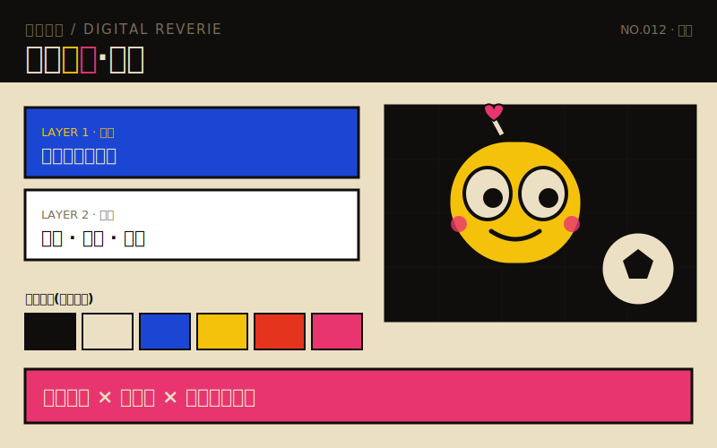
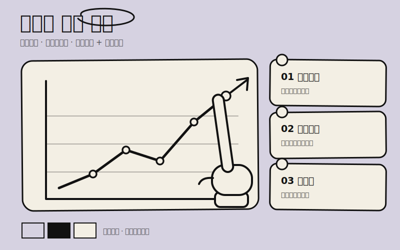

# 梦呓设计 · 风格 Skill 集合 / Mengyi Design

我的视觉风格 Claude Skill 集合。每个 skill 把「内容」套进一套固定风格,产出**可直接发社交媒体/文档/演示的成品**(长图、多图轮播、PPT 幻灯片,均为 HTML,可导出 PNG/PDF),并附 AI 出图 / 出视频提示词。

每个 skill 都是一条**可决策、可验证、可恢复、可交接**的工作流,而不是一段 prompt:
- **决策表**:先判断要做哪种产物(长图 / 多图 / PPT / 插图 / **文章插画** / 视频),按需只读对应文件(渐进式上下文)。其中「文章插画」分支**不套任何版式**——只锁风格,构图交给文章内容 + AI 自由发挥。
- **风格契约**:色板 / 字体 / 质感代码 / 锚点结构,统一来源,保证成系列。
- **自检闸门**:`scripts/check_style.py` 客观校验出图是否达标(配色规则、字体、质感、风格铁律),有 FAIL 必须改到通过再交付。

## 包含的风格

### 1. 电子梦呓 · `skills/mechanical-oracle/`



复古丝网(risograph)× 暖米底高饱和 × **可爱机械拟人**。把概念拟人成可爱机械吉祥物,半调网点 + 纸张颗粒 + 位移滤镜,社媒友好。
- 配色可换(默认即品牌):规则 = 墨黑底 + 暖纸底 + ≥3 个高饱和强调色;预设 经典 / 霓虹夜 / 薄荷糖 / 暮山红。
- 字体:Noto Sans SC 900 + Space Mono。

### 2. Anthropic 手绘极简 · `skills/anthropic-sketch/`



极简扁平 × 粗黑马克笔手绘线 × 三色克制 × 几何图表 + 手部动作(类 Excalidraw 白板手绘)。
- 配色可换:规则 = 低饱和 + 近黑墨线 + 浅色卡片;预设 紫灰 / 暖米 / 淡蓝 / 薄荷 / 裸粉。
- 扁平铁律:无阴影 / 渐变 / 3D(自检硬闸门)。
- 字体:ZCOOL KuaiLe + Kalam + Noto Sans SC。

## 仓库结构

```
mengyi-design/
├── .claude-plugin/
│   └── marketplace.json          插件市场清单(可被 /plugin marketplace add 识别)
├── skills/                       所有风格 skill 都在这里
│   ├── mechanical-oracle/        电子梦呓
│   └── anthropic-sketch/         Anthropic 手绘极简
├── previews/                     README 用的风格预览图
├── dist/                         打包好的 .skill(可手动导入)
├── README.md
└── LICENSE
```

每个 skill 内部:

```
skills/<skill>/
├── SKILL.md                      工作流入口:触发 / 决策表 / 工作流 / 自检 / 交接
├── LICENSE.txt
├── references/
│   ├── style-core.md             风格契约(色板/字体/质感/锚点)
│   ├── illustration-prompts.md   套版图位提示词(固定主体公式)
│   ├── article-illustration.md   文章插画提示词(只锁风格,AI 自由构图)
│   └── video-prompts.md          AI 出视频提示词(中+英,图生/文生)
├── assets/
│   ├── changtu.html              长图版模板
│   ├── duotu.html                多图 / 轮播版模板(3:4)
│   └── deck.html                 PPT 版模板(16:9)
└── scripts/
    └── check_style.py            出图质量自检脚本
```

## 安装与使用

**方式一 · 作为 Claude Code 插件市场(推荐)**
```
/plugin marketplace add vc999999999/mengyi-design
/plugin install mengyi-styles@mengyi-design
```
即可装上合集里的两套风格 skill(`mengyi-styles` 插件包含两者)。

**方式二 · 手动放入 skills 目录**
把 `skills/mechanical-oracle/`、`skills/anthropic-sketch/` 复制到 `~/.claude/skills/`。

**方式三 · .skill 包**
用 `dist/` 里的 `.skill`,在支持 Claude Skill 的客户端导入。

**使用:** 安装后,跟 Claude 说「用电子梦呓风格把这篇做成长图」「用手绘极简做一套九宫格」即可;它会按工作流出 HTML 成品,并跑自检。

**导出成图:** 浏览器打开生成的 HTML → 对 `.poster` / `.card` / `.slide` 截图(2x DPI),或打印为 PDF。

**依赖:** 渲染需联网加载 Google Fonts;自检脚本需 Python 3(仅标准库)。

## 自检

```bash
python skills/<skill>/scripts/check_style.py 你的产出.html
```
有 `FAIL` 表示未达风格标准,改到全 `PASS` 再用。

## 新增一套风格

照 [`template/`](template/) 里的脚手架与步骤来:拷骨架 → 改风格契约 → 改各分支与自检 → 登记进 `marketplace.json` → 配预览图。详见 [template/README.md](template/README.md)。
